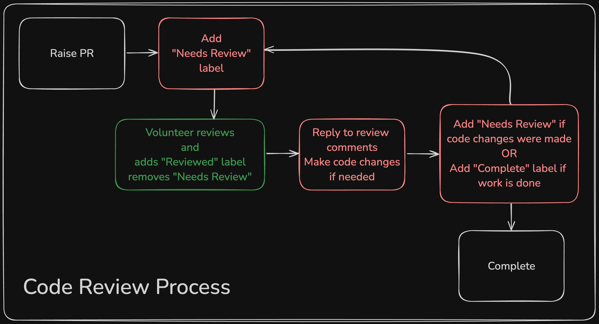

# Everyone reviews code at CYF

https://curriculum.codeyourfuture.io/guides/reviewing/

Mentors and participants all review code, and collaborate on improving code quality. We are all helping each other to talk, write, and think about code more clearly.

We are not reviewing code as if we were to merge this PR into production; we are opening a technical conversation for the purpose of insight and development.

## Key points:

1. Ask questions instead of making statements:

   **YES:** "Is there another element you could use to group a set of fields in a form? Why might someone use a different element in a form?"
   **NO:** "Use fieldset not divs"

2. Encourage simplicity, clarity, and precision:

   **YES** "There are 15,0000 files in this changelist. Which files should be reviewed?"
   **NO** "It doesn't matter; I can try to figure out what you meant."

3. Respect everyone's work and time:

   **YES** "I think there's some more to do here. Thanks for sharing where you're up to."
   **NO** "This is rubbish. Try harder."

## Getting your pull request reviewed
We're using GitHub Labels in our Code Review process. In order for a volunteer to review a pull request, a participant will need to add a "Needs Review" label to it.

To add a label to a pull request:
- Open the pull request
- In the right sidebar, click Labels, then select the label you'd like to add - for example: "Needs Review"

Take a look at our code review process from beginning to end. Let us know if you have any questions or need help!

## Labels for feedback

Reviewers, please add labels (provided) to the PR once you've reviewed. This helps to focus the participant on the areas they should work on, and gives an overview for mentors on what the whole cohort needs to work on.

## Solutions

### Where to find solutions?

You can find the solutions for the module on the `solutions` branch.

### Solutions branch

The solutions branch typically contains:

#### Sample solutions

Solutions are example answers not the only correct answers.

#### Common responses guides.

Everyone is invited to contribute commonly encountered problems, mistakes, misunderstandings, and mental-model errors to our common responses documents.

Use these resources to inform your code review, get unstuck, and improve your understanding.

## Guides

https://curriculum.codeyourfuture.io/guides/reviewing/
